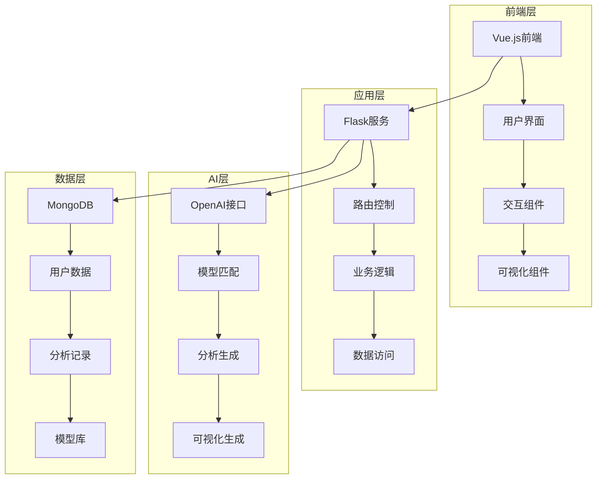
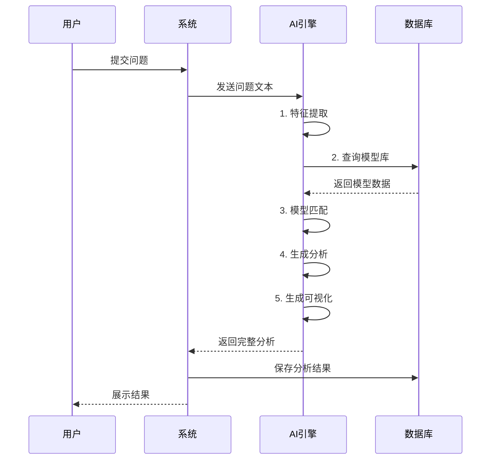

# AI思维模型分析系统设计文档

## 1. 系统概述

### 1.1 项目背景
在当今复杂的问题解决环境中，系统化思维变得越来越重要。然而，很多人并不了解如何选择和运用合适的思维模型。本系统旨在通过AI技术，帮助用户自动匹配最适合的思维模型，并提供系统化的分析方法。

### 1.2 设计目标
- 自动化：通过AI实现思维模型的智能匹配
- 系统化：提供结构化的思维分析方法
- 可视化：直观展示分析过程和结果
- 教育性：帮助用户学习和掌握不同的思维模型
- 实用性：解决实际问题，提供可行建议

## 2. 系统架构

### 2.1 整体架构


### 2.2 核心模块
1. **用户界面模块**
   - 响应式设计
   - 实时交互
   - 动态可视化
   - 用户反馈

2. **AI分析引擎**
   - 问题特征提取
   - 模型匹配算法
   - 分析生成器
   - 可视化转换器

3. **思维模型库**
   - 模型分类管理
   - 模型特征索引
   - 应用场景匹配
   - 示例库

4. **数据管理模块**
   - 用户管理
   - 分析历史
   - 模型数据
   - 反馈数据

## 3. 详细设计

### 3.1 数据模型设计

#### 3.1.1 用户模型
```json
{
    "user_id": "ObjectId",
    "username": "String",
    "email": "String",
    "password": "String(hashed)",
    "created_at": "DateTime",
    "preferences": {
        "favorite_models": ["String"],
        "theme": "String",
        "notification_settings": "Object"
    },
    "statistics": {
        "total_analysis": "Integer",
        "favorite_model": "String",
        "usage_frequency": "Object"
    }
}
```

#### 3.1.2 分析记录模型
```json
{
    "analysis_id": "ObjectId",
    "user_id": "ObjectId",
    "question": "String",
    "model_used": {
        "model_id": "ObjectId",
        "name": "String",
        "category": "String"
    },
    "analysis_result": {
        "summary": "String",
        "details": "Object",
        "recommendations": ["String"]
    },
    "visualization": {
        "type": "String",
        "data": "Object",
        "mermaid_code": "String"
    },
    "created_at": "DateTime",
    "updated_at": "DateTime",
    "feedback": {
        "rating": "Integer",
        "comments": "String",
        "helpful": "Boolean"
    }
}
```

#### 3.1.3 思维模型模型
```json
{
    "model_id": "ObjectId",
    "name": "String",
    "category": "String",
    "description": "String",
    "key_features": ["String"],
    "application_scenarios": ["String"],
    "steps": [{
        "step_number": "Integer",
        "description": "String",
        "tips": "String"
    }],
    "examples": [{
        "scenario": "String",
        "analysis": "Object",
        "outcome": "String"
    }],
    "visualization_template": {
        "type": "String",
        "structure": "Object"
    },
    "effectiveness_stats": {
        "usage_count": "Integer",
        "average_rating": "Float",
        "success_rate": "Float"
    }
}
```

### 3.2 API设计

#### 3.2.1 用户接口
- POST /api/auth/register
- POST /api/auth/login
- GET /api/auth/profile
- PUT /api/auth/profile
- POST /api/auth/logout

#### 3.2.2 分析接口
- POST /api/analysis/analyze
- GET /api/analysis/history
- GET /api/analysis/{id}
- PUT /api/analysis/{id}/feedback
- DELETE /api/analysis/{id}

#### 3.2.3 模型接口
- GET /api/models
- GET /api/models/{id}
- GET /api/models/categories
- GET /api/models/search

### 3.3 AI处理流程


## 4. 安全设计

### 4.1 用户认证
- JWT token认证
- 密码加密存储
- 会话管理
- 权限控制

### 4.2 数据安全
- 数据加密
- 访问控制
- 日志记录
- 备份策略

### 4.3 API安全
- 请求限流
- CORS配置
- 输入验证
- 错误处理

## 5. 性能优化

### 5.1 数据库优化
- 索引设计
- 查询优化
- 缓存策略
- 数据分片

### 5.2 应用优化
- 异步处理
- 负载均衡
- 资源压缩
- 代码优化

### 5.3 前端优化
- 懒加载
- 缓存管理
- 资源合并
- 渲染优化

## 6. 监控和维护

### 6.1 系统监控
- 性能监控
- 错误监控
- 用户行为分析
- 资源使用监控

### 6.2 维护计划
- 定期备份
- 版本更新
- 安全补丁
- 性能调优

## 7. 扩展性设计

### 7.1 模型扩展
- 新模型接入
- 模型更新
- 自定义模型
- 模型评估

### 7.2 功能扩展
- API扩展
- 插件系统
- 第三方集成
- 自定义配置

## 8. 部署方案

### 8.1 环境要求
- Python 3.8+
- MongoDB 4.4+
- Node.js 14+
- Redis (可选)

### 8.2 部署步骤
1. 环境准备
2. 依赖安装
3. 配置设置
4. 数据库初始化
5. 服务启动
6. 监控配置

### 8.3 维护流程
1. 日常监控
2. 定期备份
3. 更新升级
4. 问题处理

## 9. 风险管理

### 9.1 技术风险
- API限制
- 性能瓶颈
- 安全漏洞
- 兼容性问题

### 9.2 应对策略
- 备份方案
- 降级策略
- 应急预案
- 恢复流程 