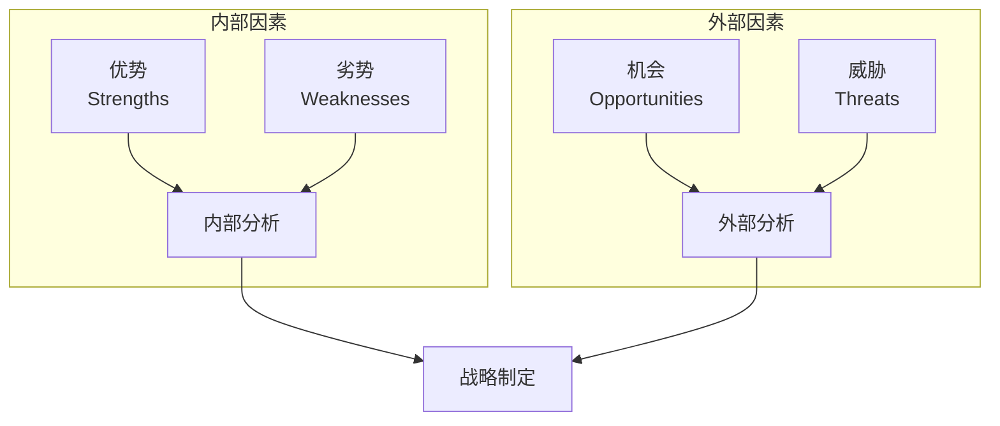
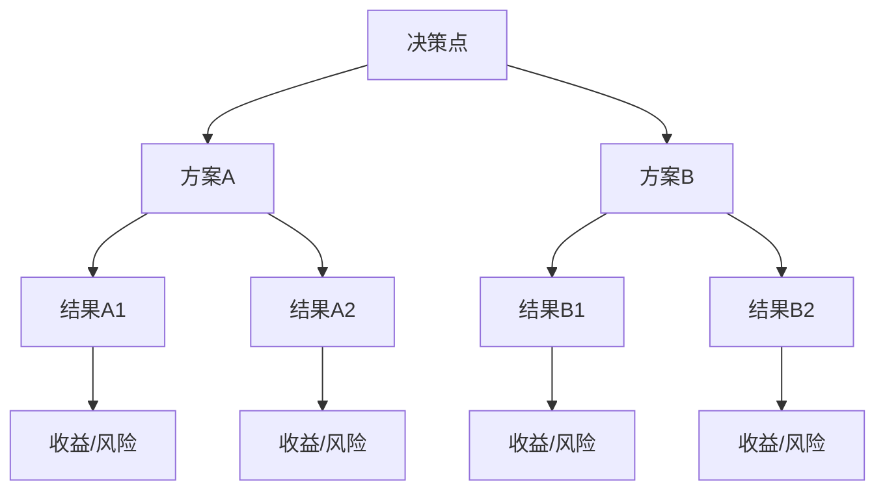
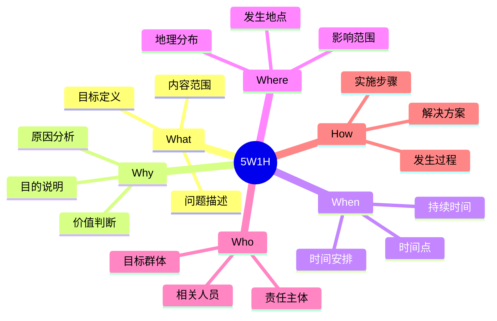
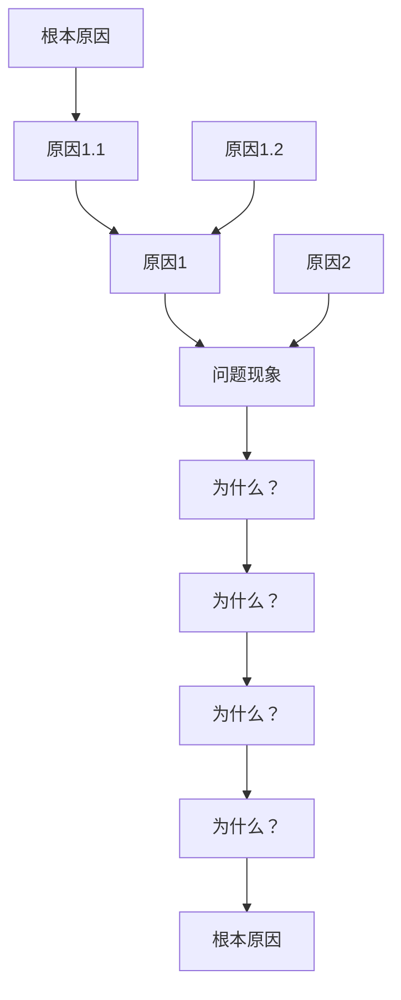
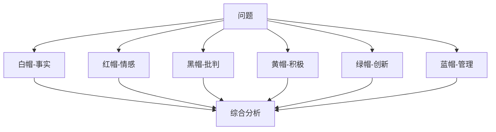
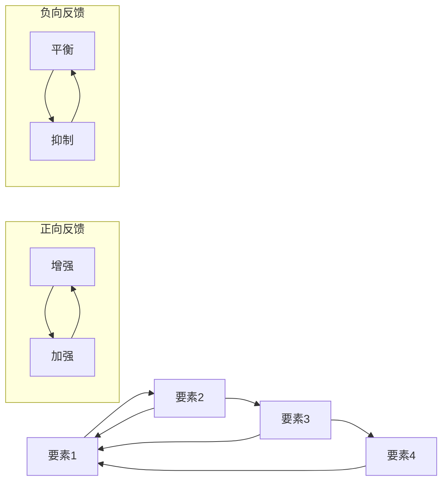

# 思维模型详细说明文档

## 1. 思维模型概述

思维模型是一种系统化思考和解决问题的方法论工具。通过使用合适的思维模型，我们可以更好地理解问题、分析情况并做出决策。本系统集成了多种类型的思维模型，以适应不同场景的需求。

## 2. 模型分类

### 2.1 决策类模型

#### 2.1.1 SWOT分析
**核心理念**：通过分析内部优势(Strengths)、劣势(Weaknesses)和外部机会(Opportunities)、威胁(Threats)，全面评估情况并制定策略。

**适用场景**：
- 战略规划与决策
- 项目可行性分析
- 竞争策略制定
- 个人职业规划

**分析步骤**：
1. 识别内部优势
   - 核心竞争力
   - 独特资源
   - 品牌价值
2. 评估内部劣势
   - 资源短缺
   - 能力不足
   - 效率问题
3. 发现外部机会
   - 市场趋势
   - 技术发展
   - 政策支持
4. 预测潜在威胁
   - 竞争压力
   - 环境变化
   - 风险因素
5. 制定应对策略
   - SO策略（利用优势抓住机会）
   - WO策略（改善劣势把握机会）
   - ST策略（利用优势应对威胁）
   - WT策略（改善劣势规避威胁）

**可视化示例**：

**实际案例**：
1. 企业战略分析
2. 产品发展规划
3. 市场竞争分析

#### 2.1.2 决策树
**核心理念**：通过树状结构展示决策过程中的各种可能选择和结果，帮助做出最优决策。

**适用场景**：
- 多方案选择
- 风险评估
- 投资决策
- 项目管理

**分析步骤**：
1. 定义决策问题
2. 识别可能选项
3. 评估各项结果
4. 计算概率和收益
5. 选择最优路径

**可视化示例**：

### 2.2 问题解决类模型

#### 2.2.1 5W1H分析
**核心理念**：通过What（什么）、Why（为什么）、When（何时）、Where（何地）、Who（谁）和How（如何）六个维度全面分析问题。

**适用场景**：
- 问题定义
- 流程优化
- 项目规划
- 事件分析

**分析框架**：
1. What（什么）
   - 问题是什么
   - 目标是什么
   - 涉及什么内容
2. Why（为什么）
   - 为什么发生
   - 原因是什么
   - 目的是什么
3. When（何时）
   - 什么时候发生
   - 持续多久
   - 时间节点
4. Where（何地）
   - 在哪里发生
   - 影响范围
   - 地理位置
5. Who（谁）
   - 相关人员
   - 责任人
   - 受众群体
6. How（如何）
   - 如何发生的
   - 如何解决
   - 实施方法

**可视化示例**：

#### 2.2.2 根本原因分析
**核心理念**：通过系统性追问找出问题的根本原因，而不是停留在表面现象。

**适用场景**：
- 故障诊断
- 质量改进
- 流程优化
- 问题预防

**分析方法**：
1. 5个为什么
   - 持续追问为什么
   - 层层深入
   - 找到根源
2. 因果图分析
   - 识别主要原因
   - 分析次要原因
   - 建立因果关系
3. 数据验证
   - 收集证据
   - 验证假设
   - 确认根因

**可视化示例**：

### 2.3 创新思维类模型

#### 2.3.1 六顶思考帽
**核心理念**：通过不同颜色的帽子代表不同的思维方式，全面思考问题。

**思维模式**：
1. 白帽（客观事实）
   - 信息收集
   - 数据分析
   - 客观描述
2. 红帽（情感直觉）
   - 感受表达
   - 直觉判断
   - 情感反应
3. 黑帽（批判思维）
   - 风险识别
   - 问题指出
   - 逻辑判断
4. 黄帽（积极思维）
   - 价值发现
   - 机会识别
   - 乐观展望
5. 绿帽（创新思维）
   - 创意生成
   - 方案创新
   - 突破常规
6. 蓝帽（思维管理）
   - 过程控制
   - 总结归纳
   - 决策制定

**可视化示例**：

### 2.4 系统思维类模型

#### 2.4.1 系统动力学
**核心理念**：分析系统中各要素之间的相互作用和反馈关系，理解系统的整体行为。

**应用领域**：
- 组织管理
- 生态系统
- 社会经济
- 项目管理

**分析步骤**：
1. 系统边界定义
2. 要素识别
3. 关系分析
4. 反馈环路识别
5. 动态模拟

**可视化示例**：

## 3. 模型选择指南

### 3.1 选择标准
1. 问题类型
2. 应用场景
3. 数据可用性
4. 时间约束
5. 资源限制

### 3.2 常见问题类型与推荐模型
1. 战略决策 → SWOT分析
2. 方案选择 → 决策树
3. 问题分析 → 5W1H
4. 根因查找 → 根本原因分析
5. 创新思考 → 六顶思考帽
6. 系统优化 → 系统动力学

### 3.3 模型组合使用
某些复杂问题可能需要组合多个模型：
1. SWOT + 决策树
2. 5W1H + 根本原因分析
3. 六顶思考帽 + 系统动力学

## 4. 实践建议

### 4.1 应用技巧
1. 明确目标
2. 收集数据
3. 严格执行步骤
4. 及时记录结果
5. 定期回顾优化

### 4.2 常见误区
1. 过度简化
2. 忽视数据
3. 主观臆断
4. 跳步执行
5. 机械套用

### 4.3 效果评估
1. 目标达成度
2. 解决效率
3. 实施成本
4. 可持续性
5. 副作用影响

## 5. 持续改进

### 5.1 模型优化
1. 收集用户反馈
2. 分析应用效果
3. 更新模型内容
4. 完善操作指南
5. 优化可视化展示

### 5.2 知识积累
1. 案例库建设
2. 最佳实践总结
3. 经验教训记录
4. 专家见解收集
5. 培训资料开发 