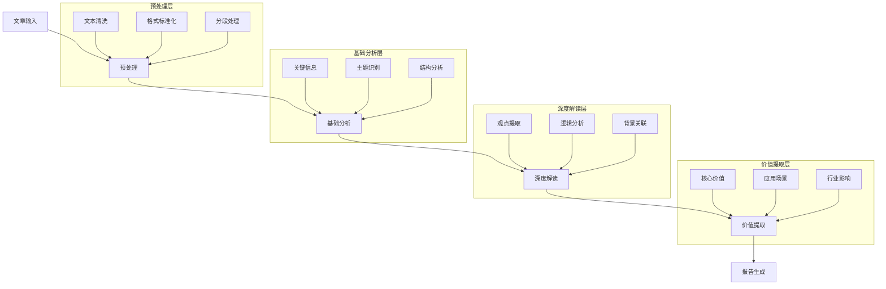
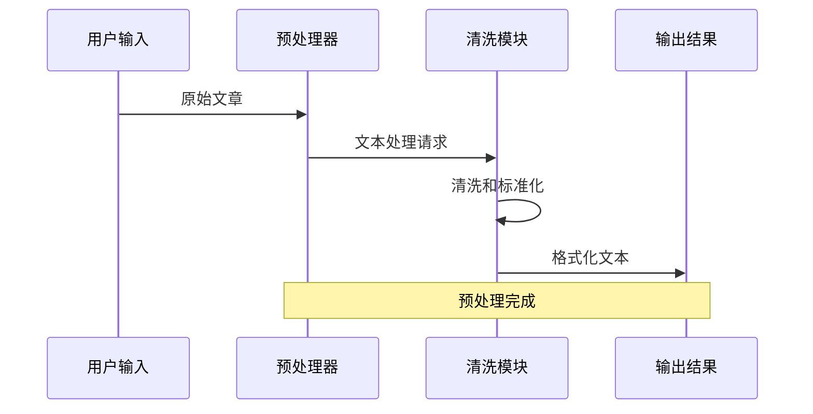
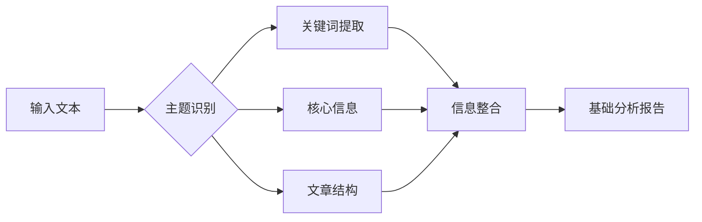
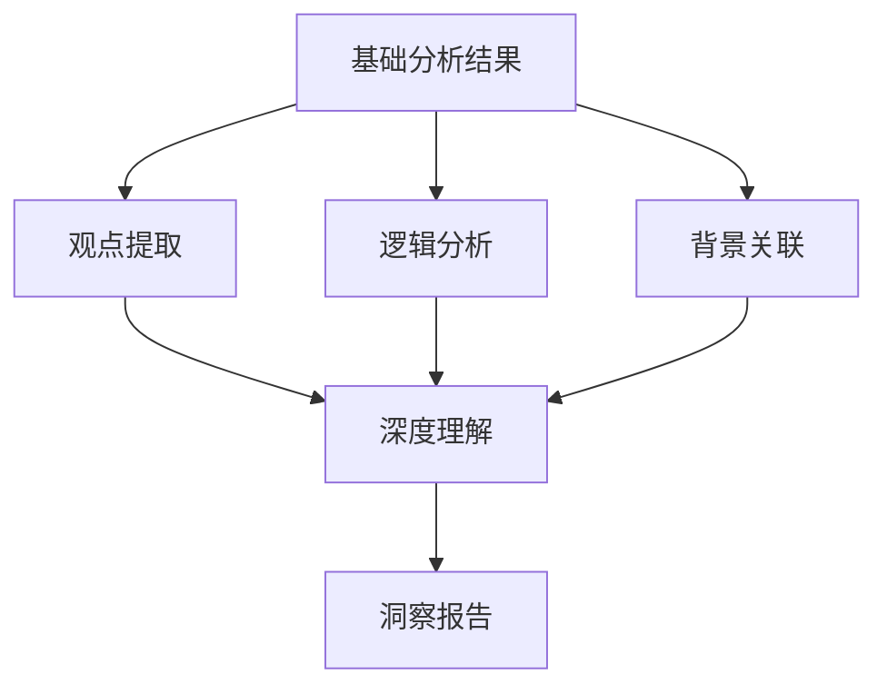
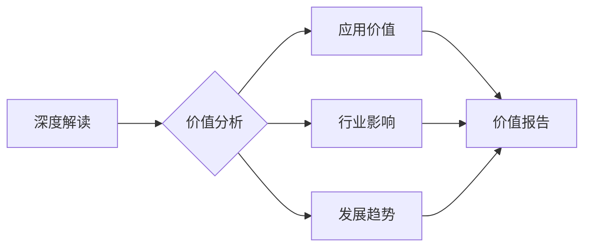
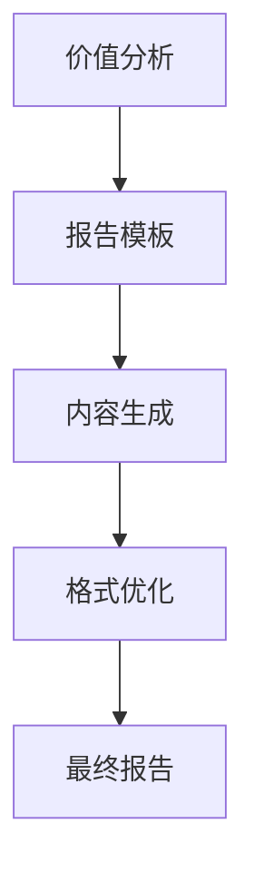
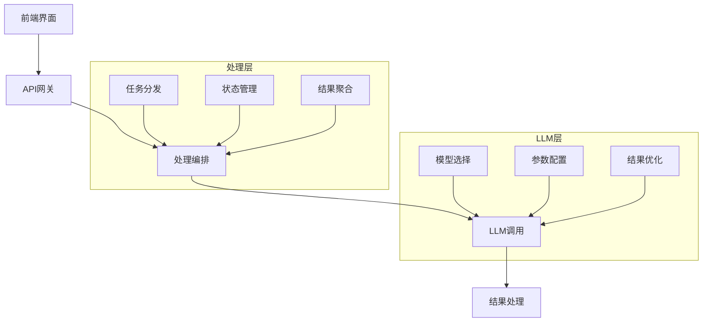
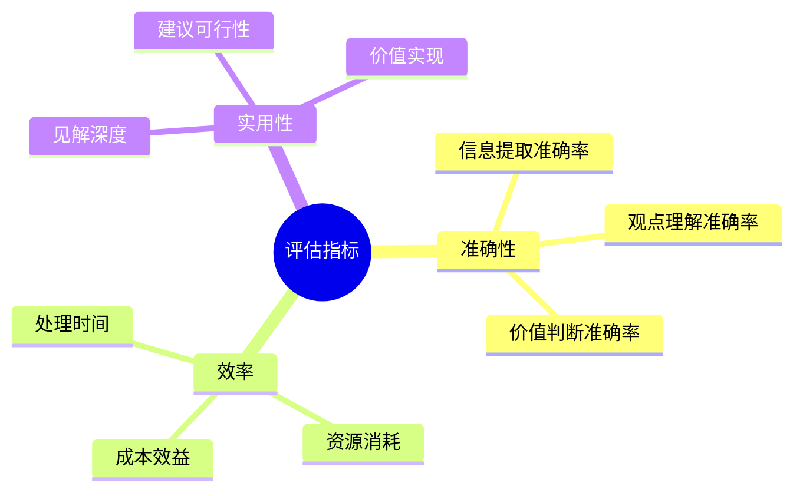

# AI文章智能解读系统设计方案

## 1. 系统概述

本系统旨在通过AI自动化完成文章的深度解读，从信息提取到价值分析的全流程处理。系统采用多轮对话和链式思考方式，通过精心设计的Prompt提示词引导AI完成分析任务。

## 2. 工作流程设计

### 2.1 整体流程


### 2.2 处理节点设计

#### 1. 预处理节点


**预处理Prompt模板**：
```text
系统角色：你是一个专业的文本预处理专家，负责清理和标准化文章格式。

任务目标：对输入的文章进行预处理，包括格式标准化、去除噪声、结构优化。

处理要求：
1. 保持原文的核心内容和结构
2. 去除无关的格式标记和特殊字符
3. 规范段落和标点符号
4. 确保文本的可读性和连贯性

输入文本：
{input_text}

请按以下格式输出处理后的文本：
标题：
[处理后的标题]

正文：
[处理后的正文，保持段落结构]

元信息：
- 字数：
- 段落数：
- 处理建议：
```

#### 2. 基础分析节点


**基础分析Prompt模板**：
```text
系统角色：你是一个专业的文章分析专家，擅长提取文章的基础信息和结构。

任务目标：对文章进行基础分析，提取关键信息和结构特征。

分析维度：
1. 主题识别：识别文章的核心主题和子主题
2. 关键词提取：提取最重要的10个关键词或短语
3. 文章结构：分析文章的组织结构和逻辑框架
4. 核心信息：提取文章中最重要的信息点

输入文本：
{processed_text}

请输出以下分析结果：

1. 主题分析：
- 主题：
- 子主题：

2. 关键词列表：
- 关键词1（重要性分数）
- 关键词2（重要性分数）
[...]

3. 结构分析：
- 开篇：
- 主体：
- 结论：

4. 核心信息：
- 信息点1
- 信息点2
[...]
```

#### 3. 深度解读节点


**深度解读Prompt模板**：
```text
系统角色：你是一个专业的深度分析专家，擅长文章的深层解读和价值挖掘。

任务目标：基于基础分析结果，对文章进行深度解读和价值挖掘。

解读维度：
1. 观点分析：提取和评估文章的核心观点
2. 逻辑分析：分析论证结构和推理过程
3. 背景关联：关联相关的背景信息和知识
4. 价值评估：评估观点的创新性和应用价值

输入信息：
{basic_analysis_result}

请提供以下深度解读：

1. 观点分析：
- 核心观点：
- 支撑论据：
- 创新点：

2. 逻辑分析：
- 论证结构：
- 推理过程：
- 逻辑强度：

3. 背景关联：
- 相关领域：
- 背景信息：
- 知识关联：

4. 价值评估：
- 理论价值：
- 实践价值：
- 创新价值：
```

#### 4. 价值提取节点


**价值提取Prompt模板**：
```text
系统角色：你是一个专业的价值分析专家，擅长挖掘内容的实际应用价值。

任务目标：基于深度解读结果，提取和分析文章的实际价值和应用潜力。

分析维度：
1. 应用价值：评估实际应用场景和价值
2. 行业影响：分析对相关行业的影响
3. 发展趋势：预测相关领域的发展趋势
4. 建议措施：提出具体的应用建议

输入信息：
{deep_analysis_result}

请提供以下价值分析：

1. 应用价值：
- 应用场景：
- 价值点：
- 实施建议：

2. 行业影响：
- 直接影响：
- 间接影响：
- 长期影响：

3. 发展趋势：
- 短期趋势：
- 中期趋势：
- 长期趋势：

4. 建议措施：
- 企业层面：
- 行业层面：
- 政策层面：
```

#### 5. 报告生成节点


**报告生成Prompt模板**：
```text
系统角色：你是一个专业的报告撰写专家，擅长将分析结果转化为清晰的报告。

任务目标：将所有分析结果整合为一份完整的分析报告。

报告要求：
1. 结构清晰：层次分明，重点突出
2. 内容完整：覆盖所有分析维度
3. 表达专业：用语准确，逻辑严谨
4. 价值导向：突出实践指导价值

输入信息：
{all_analysis_results}

请生成以下格式的报告：

# 文章解读报告

## 1. 执行摘要
[一段话总结最重要的发现和建议]

## 2. 基础分析
[基础分析结果的整理呈现]

## 3. 深度解读
[深度解读结果的系统呈现]

## 4. 价值分析
[价值分析结果的详细呈现]

## 5. 建议措施
[具体可行的建议和措施]

## 6. 附录
[相关数据和支撑材料]
```

## 3. 系统实现建议

### 3.1 技术架构


### 3.2 关键配置

1. **模型选择**
   - 主力模型：GPT-4（精度要求高的任务）
   - 辅助模型：GPT-3.5（基础任务）
   - 备选模型：Claude/Gemini（特定任务）

2. **参数配置**
   - Temperature：0.3-0.7（根据任务调整）
   - Max Tokens：根据任务定制
   - Top P：0.9（保持稳定输出）

3. **性能优化**
   - 并行处理
   - 缓存机制
   - 失败重试

## 4. 效果评估

### 4.1 评估指标


### 4.2 优化方向

1. **提示词优化**
   - 持续收集反馈
   - 迭代优化模板
   - 场景适配调整

2. **流程优化**
   - 简化处理步骤
   - 提高并行度
   - 优化响应时间

3. **结果优化**
   - 提高分析深度
   - 增强实用性
   - 改进表达形式

## 5. 应用建议

### 5.1 实施路径
1. **试点阶段**
   - 选择特定类型文章
   - 验证基本功能
   - 收集用户反馈

2. **优化阶段**
   - 完善提示词
   - 优化处理流程
   - 提升分析质量

3. **推广阶段**
   - 扩大应用范围
   - 建立评估体系
   - 持续改进优化

### 5.2 注意事项
1. **质量控制**
   - 定期评估结果
   - 人工抽检验证
   - 及时调整优化

2. **成本控制**
   - 合理分配资源
   - 优化调用策略
   - 监控使用成本

3. **安全保障**
   - 数据安全防护
   - 隐私信息保护
   - 结果可靠性验证 