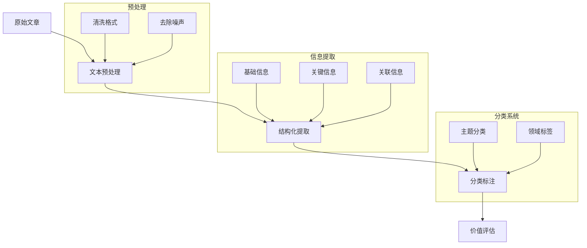
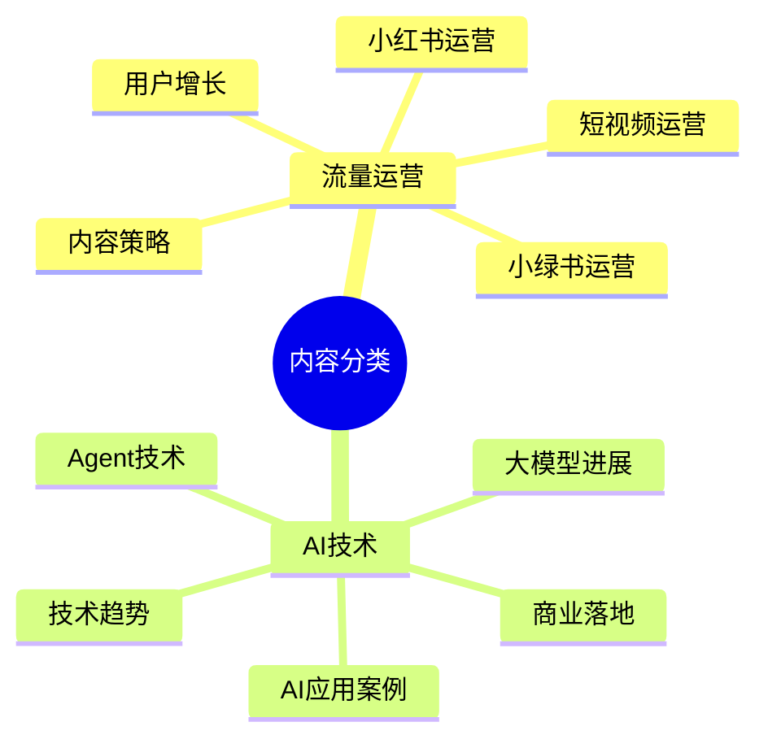
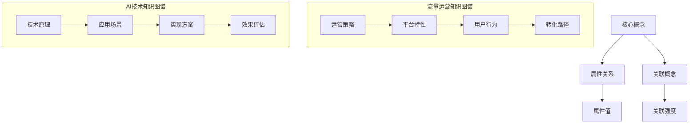
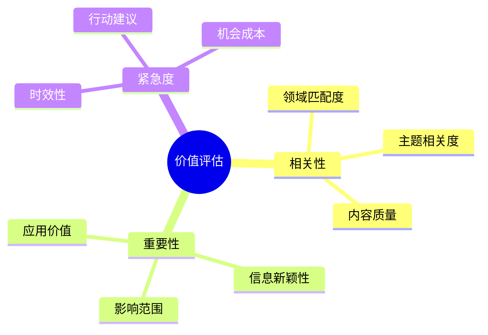
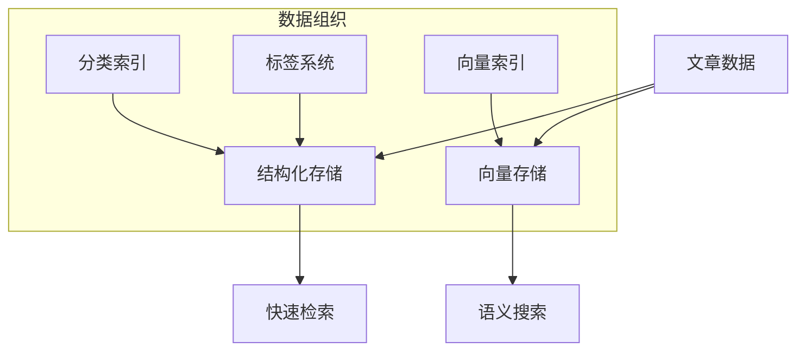
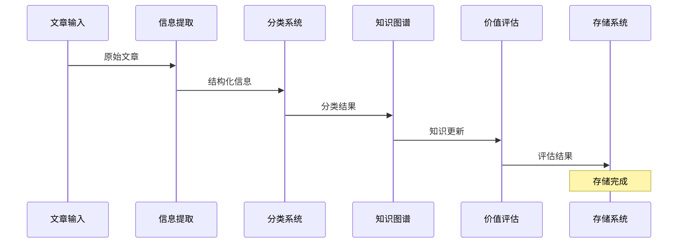
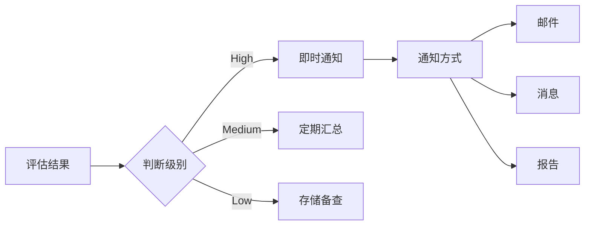

# AI文章处理与知识管理系统

## 1. 信息结构化处理

### 1.1 文章JSON结构
```json
{
  "article_id": "唯一标识符",
  "basic_info": {
    "title": "文章标题",
    "publish_time": "发布时间",
    "source": "来源平台",
    "author": "作者信息",
    "url": "原文链接"
  },
  "content_info": {
    "keywords": ["关键词1", "关键词2", "..."],
    "summary": "文章摘要",
    "related_links": ["相关链接1", "相关链接2", "..."],
    "main_topics": ["主题1", "主题2", "..."]
  },
  "classification": {
    "primary_category": "主分类",
    "sub_category": "子分类",
    "tags": ["标签1", "标签2", "..."]
  },
  "value_assessment": {
    "relevance_score": 0.95,
    "importance_score": 0.85,
    "urgency_score": 0.75,
    "notification_level": "HIGH/MEDIUM/LOW"
  }
}
```

### 1.2 信息提取流程


## 2. 分类体系设计

### 2.1 核心分类


### 2.2 分类处理Prompt
```text
系统角色：你是一个专业的内容分类专家，精通流量运营和AI技术领域。

任务目标：判断文章是否属于关注的领域，并进行准确分类。

关注领域：
1. 流量运营：小红书、小绿书、短视频、内容策略、用户增长
2. AI技术：大模型、Agent、应用案例、技术趋势、商业落地

输入：
{article_json}

请输出：
{
  "is_relevant": true/false,
  "primary_category": "主分类",
  "sub_category": "子分类",
  "relevance_score": 0.95,
  "tags": ["标签1", "标签2"],
  "reason": "分类理由"
}
```

## 3. 知识图谱构建

### 3.1 知识图谱结构


### 3.2 知识更新Prompt
```text
系统角色：你是一个知识图谱专家，负责维护和更新领域知识库。

任务目标：将新文章的知识点整合到已有知识图谱中。

处理步骤：
1. 提取新知识点
2. 建立关联关系
3. 更新知识库
4. 解决冲突

输入：
- 新文章信息：{article_json}
- 现有知识图谱：{knowledge_graph}

请输出：
{
  "new_knowledge": ["新知识点1", "新知识点2"],
  "updated_relations": ["关系1", "关系2"],
  "conflict_resolution": ["解决方案1", "解决方案2"],
  "knowledge_graph_updates": {
    "add": ["新增内容"],
    "modify": ["修改内容"],
    "delete": ["删除内容"]
  }
}
```

## 4. 价值评估系统

### 4.1 评分维度


### 4.2 评估Prompt
```text
系统角色：你是一个内容价值评估专家，精通信息价值判断。

任务目标：评估文章的价值并决定通知级别。

评估维度：
1. 相关性（0-1）：与关注领域的匹配程度
2. 重要性（0-1）：信息价值和影响力
3. 紧急度（0-1）：时效性和行动建议

输入：
{processed_article}

请输出：
{
  "value_assessment": {
    "relevance": {
      "score": 0.95,
      "reasons": ["原因1", "原因2"]
    },
    "importance": {
      "score": 0.85,
      "reasons": ["原因1", "原因2"]
    },
    "urgency": {
      "score": 0.75,
      "reasons": ["原因1", "原因2"]
    }
  },
  "notification_level": "HIGH/MEDIUM/LOW",
  "key_insights": ["洞察1", "洞察2"],
  "action_suggestions": ["建议1", "建议2"]
}
```

## 5. 存储和检索系统

### 5.1 存储结构


### 5.2 检索Prompt
```text
系统角色：你是一个高效的信息检索专家。

任务目标：根据用户需求精准检索相关信息。

检索方式：
1. 关键词检索
2. 语义相似度检索
3. 主题检索
4. 时间范围检索

输入：
{search_query}

请输出：
{
  "search_results": [
    {
      "article_id": "文章ID",
      "relevance_score": 0.95,
      "match_reason": "匹配原因",
      "key_points": ["要点1", "要点2"]
    }
  ],
  "related_topics": ["相关主题1", "相关主题2"],
  "search_suggestions": ["建议1", "建议2"]
}
```

## 6. 实现流程

### 6.1 处理流程


### 6.2 通知机制


## 7. 系统优化

### 7.1 性能优化
- 并行处理
- 缓存机制
- 批量处理
- 增量更新

### 7.2 准确性优化
- 模型微调
- 规则优化
- 反馈学习
- 人工校验

### 7.3 用户体验
- 个性化配置
- 交互优化
- 反馈机制
- 结果展示 