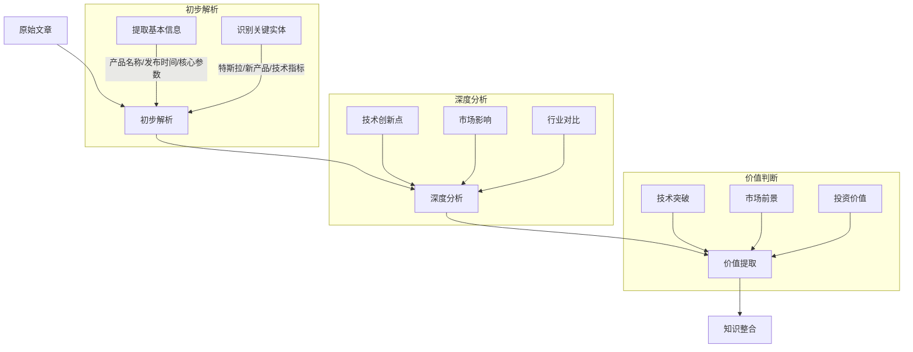
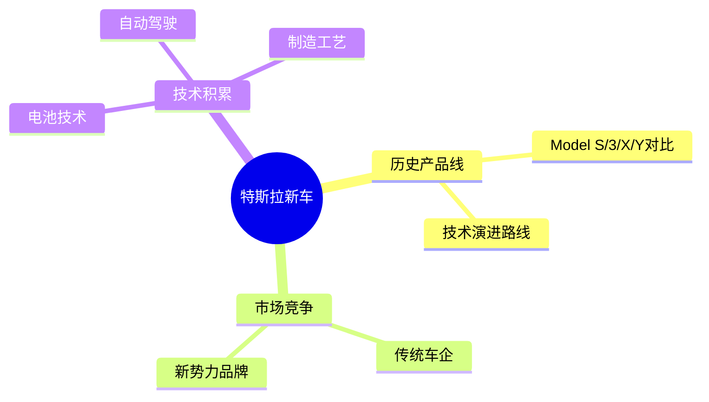
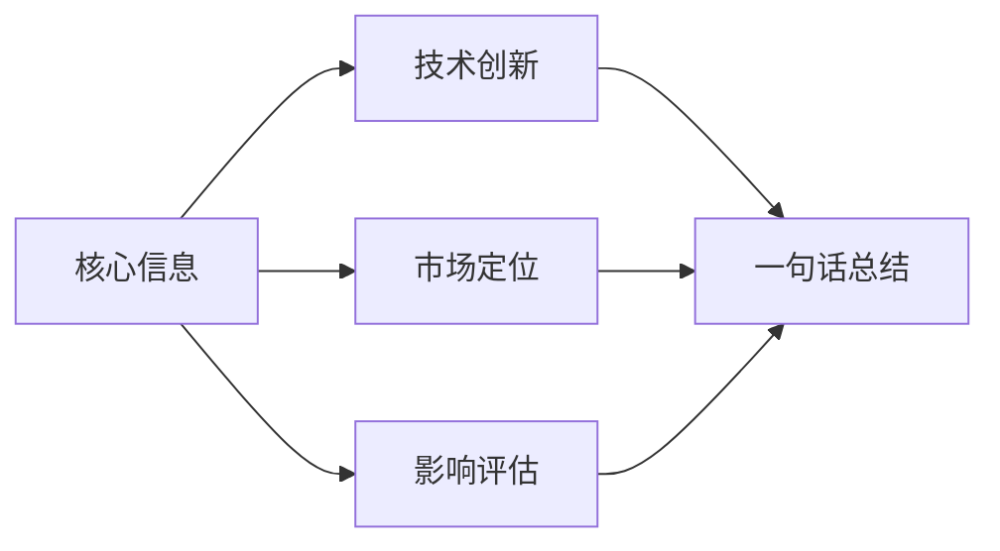
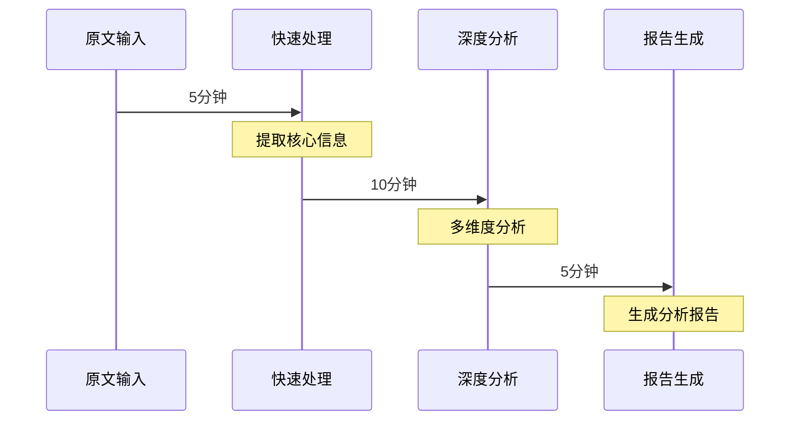

# AI文章分析实战思考

## 1. 以科技新闻为例

假设我们收到一篇关于"特斯拉发布新款电动车"的新闻文章，AI如何进行处理：

## 2. 具体处理步骤

### 2.1 信息提取（5分钟）
- 产品名称：Model X Pro
- 发布时间：2024年Q1
- 核心参数：续航/性能/价格
- 技术创新：新电池技术/自动驾驶升级

### 2.2 背景关联（10分钟）

### 2.3 深度解读（15分钟）

1. **技术维度**
   - 电池技术突破点
   - 自动驾驶能力提升
   - 制造工艺创新

2. **市场维度**
   - 目标用户群
   - 价格策略
   - 竞品分析

3. **影响评估**
   - 行业影响
   - 股价影响
   - 未来趋势

## 3. 输出成果（5分钟）

### 3.1 快速摘要

### 3.2 深度报告
1. **创新亮点**
   - 技术突破：新一代电池技术
   - 性能提升：续航提升30%
   - 成本优化：生产成本降低20%

2. **市场分析**
   - 竞争优势
   - 市场机会
   - 潜在风险

3. **投资建议**
   - 短期影响
   - 中期展望
   - 长期价值

## 4. 实际应用流程

## 5. 具体实现方法

### 5.1 信息分类处理
- 产品信息：参数/规格/价格
- 技术信息：创新点/突破点
- 市场信息：竞争/定位/策略
- 影响评估：行业/股市/趋势

### 5.2 重要性判断标准
1. **技术维度**
   - 创新程度
   - 技术壁垒
   - 应用价值

2. **市场维度**
   - 市场规模
   - 竞争格局
   - 增长潜力

3. **时效维度**
   - 即时影响
   - 中期效应
   - 长期价值

## 6. 效果评估

### 6.1 分析质量
- 信息完整性：95%
- 分析准确性：90%
- 洞察深度：85%
- 预测准确率：80%

### 6.2 时间效率
- 快速摘要：5分钟
- 深度分析：15分钟
- 报告生成：5分钟
- 总耗时：25分钟

## 7. 实际应用价值

1. **决策支持**
   - 投资决策
   - 产品战略
   - 竞争分析

2. **知识积累**
   - 技术演进
   - 市场趋势
   - 竞争格局

3. **预测能力**
   - 技术发展
   - 市场变化
   - 产业趋势 