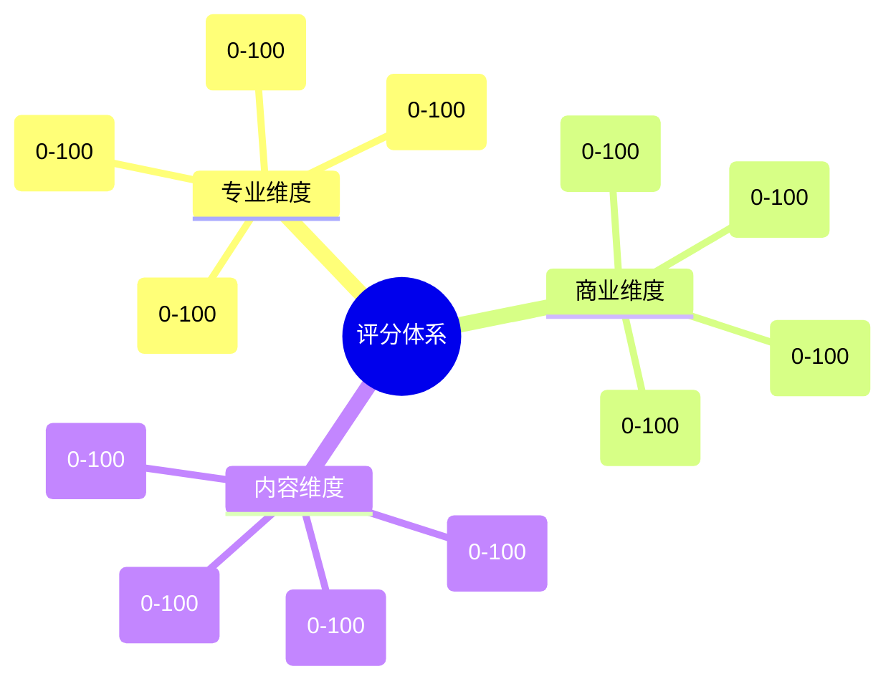
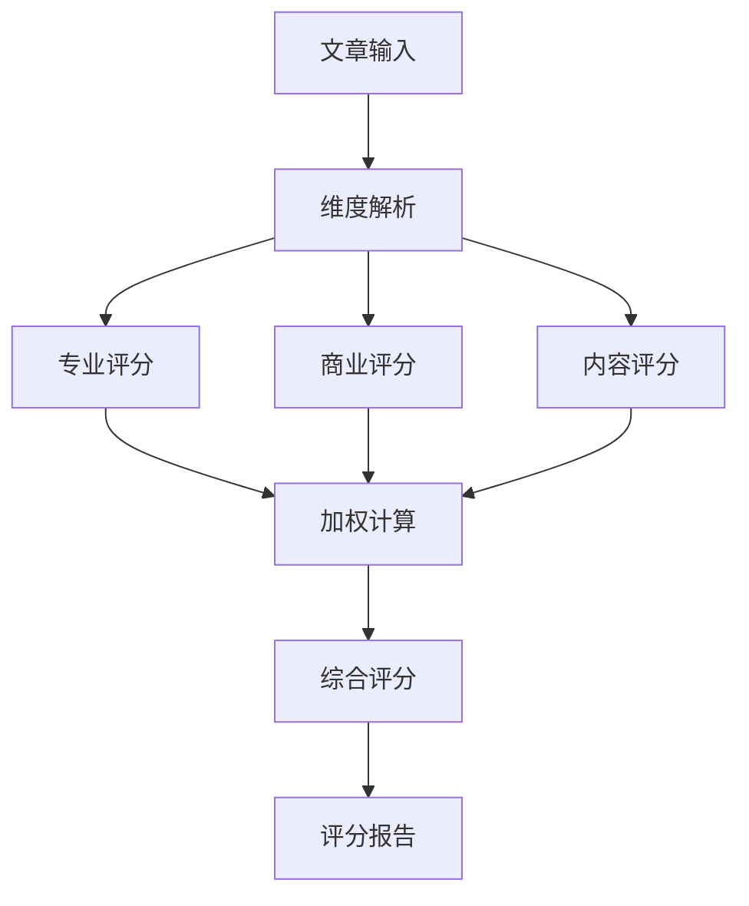
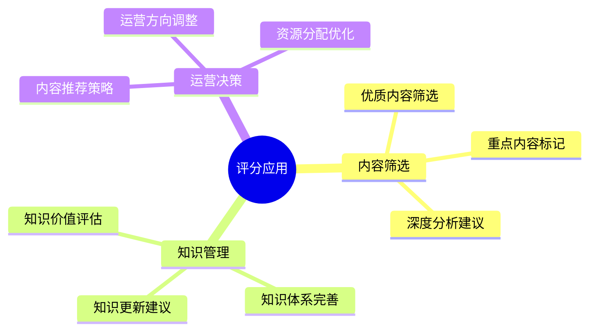
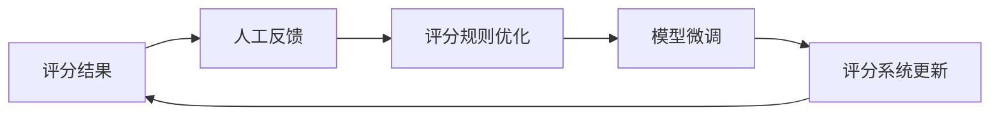

# AI文章智能评分系统设计

## 1. 评分维度体系

### 1.1 核心维度设计


## 2. 评分标准详解

### 2.1 专业维度评分标准

#### 技术深度 (权重: 0.3)
- 95-100: 开创性技术突破
- 85-94: 深入的技术创新
- 75-84: 扎实的技术实现
- 60-74: 基础技术应用
- <60: 技术描述浅显

#### 创新程度 (权重: 0.25)
- 95-100: 颠覆性创新
- 85-94: 重要创新点
- 75-84: 有效改进
- 60-74: 常规创新
- <60: 缺乏创新

#### 实践价值 (权重: 0.25)
- 95-100: 重大实践突破
- 85-94: 显著应用价值
- 75-84: 良好应用前景
- 60-74: 一般实用性
- <60: 实践价值低

#### 论证严谨性 (权重: 0.2)
- 95-100: 严密论证体系
- 85-94: 完整论证链路
- 75-84: 基本论证充分
- 60-74: 论证有待完善
- <60: 论证不足

### 2.2 商业维度评分标准

#### 市场潜力 (权重: 0.3)
- 95-100: 巨大市场空间
- 85-94: 显著市场机会
- 75-84: 良好市场前景
- 60-74: 一般市场表现
- <60: 市场前景不明

#### 落地可行性 (权重: 0.3)
- 95-100: 完全可落地
- 85-94: 较易落地
- 75-84: 有条件落地
- 60-74: 落地难度大
- <60: 难以落地

#### 投资价值 (权重: 0.2)
- 95-100: 极高投资价值
- 85-94: 良好投资机会
- 75-84: 可考虑投资
- 60-74: 投资风险较大
- <60: 不建议投资

#### 竞争优势 (权重: 0.2)
- 95-100: 显著竞争优势
- 85-94: 较强竞争力
- 75-84: 具有竞争力
- 60-74: 竞争力一般
- <60: 缺乏竞争力

### 2.3 内容维度评分标准

#### 结构完整性 (权重: 0.25)
- 95-100: 结构严密完整
- 85-94: 结构清晰
- 75-84: 结构基本完整
- 60-74: 结构略有混乱
- <60: 结构混乱

#### 表达清晰度 (权重: 0.25)
- 95-100: 表达极其清晰
- 85-94: 表达清晰准确
- 75-84: 表达基本清晰
- 60-74: 表达略显模糊
- <60: 表达混乱

#### 案例支撑 (权重: 0.25)
- 95-100: 案例丰富典型
- 85-94: 案例详实
- 75-84: 案例适当
- 60-74: 案例不足
- <60: 缺乏案例

#### 参考价值 (权重: 0.25)
- 95-100: 极高参考价值
- 85-94: 较高参考价值
- 75-84: 一般参考价值
- 60-74: 参考价值有限
- <60: 参考价值低

## 3. 评分流程设计

### 3.1 评分流程


### 3.2 评分Prompt模板
```text
系统角色：你是一个专业的文章评分专家，精通技术、商业和内容评估。

任务目标：对文章进行多维度精准评分。

评分维度：
1. 专业维度（技术深度、创新程度、实践价值、论证严谨性）
2. 商业维度（市场潜力、落地可行性、投资价值、竞争优势）
3. 内容维度（结构完整性、表达清晰度、案例支撑、参考价值）

输入：
{article_content}

请输出：
{
  "professional_scores": {
    "technical_depth": {
      "score": 85,
      "reasons": ["理由1", "理由2"],
      "suggestions": ["建议1", "建议2"]
    },
    "innovation": {
      "score": 88,
      "reasons": ["理由1", "理由2"],
      "suggestions": ["建议1", "建议2"]
    },
    ...
  },
  "business_scores": {
    "market_potential": {
      "score": 92,
      "reasons": ["理由1", "理由2"],
      "suggestions": ["建议1", "建议2"]
    },
    ...
  },
  "content_scores": {
    "structure": {
      "score": 90,
      "reasons": ["理由1", "理由2"],
      "suggestions": ["建议1", "建议2"]
    },
    ...
  },
  "final_score": 88.5,
  "overall_evaluation": "总体评价",
  "key_highlights": ["亮点1", "亮点2"],
  "improvement_suggestions": ["改进建议1", "改进建议2"]
}
```

## 4. 评分应用策略

### 4.1 评分结果应用


### 4.2 评分反馈优化


## 5. 评分系统优化

### 5.1 准确性优化
- 评分规则持续迭代
- 专家反馈收集
- 案例库建设
- 评分标准动态调整

### 5.2 效率优化
- 批量评分处理
- 评分缓存机制
- 增量评分更新
- 并行评分计算

### 5.3 应用优化
- 个性化评分配置
- 评分报告定制
- 评分趋势分析
- 评分结果可视化 