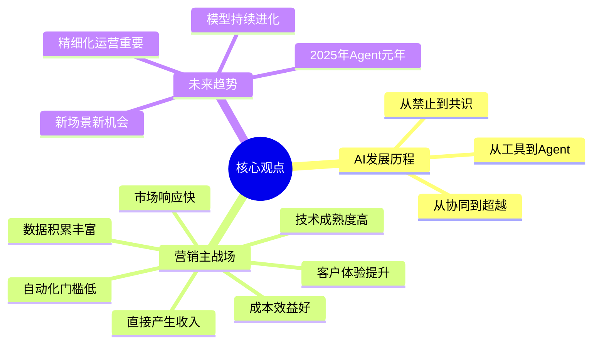
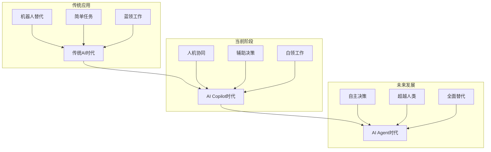
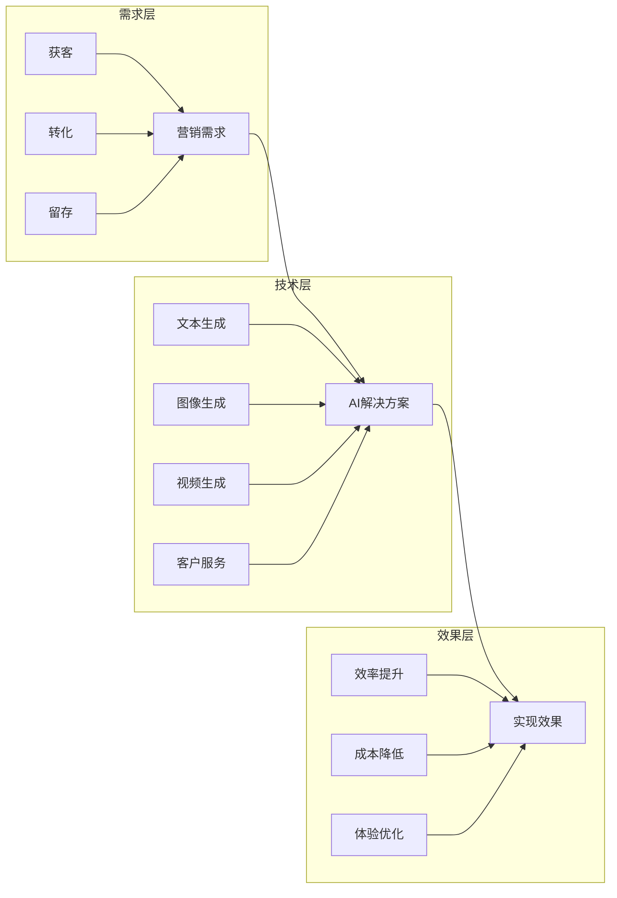
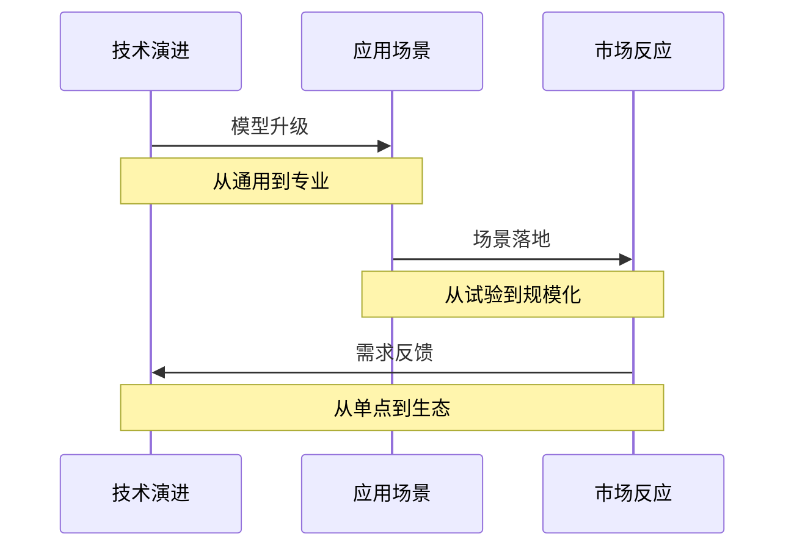
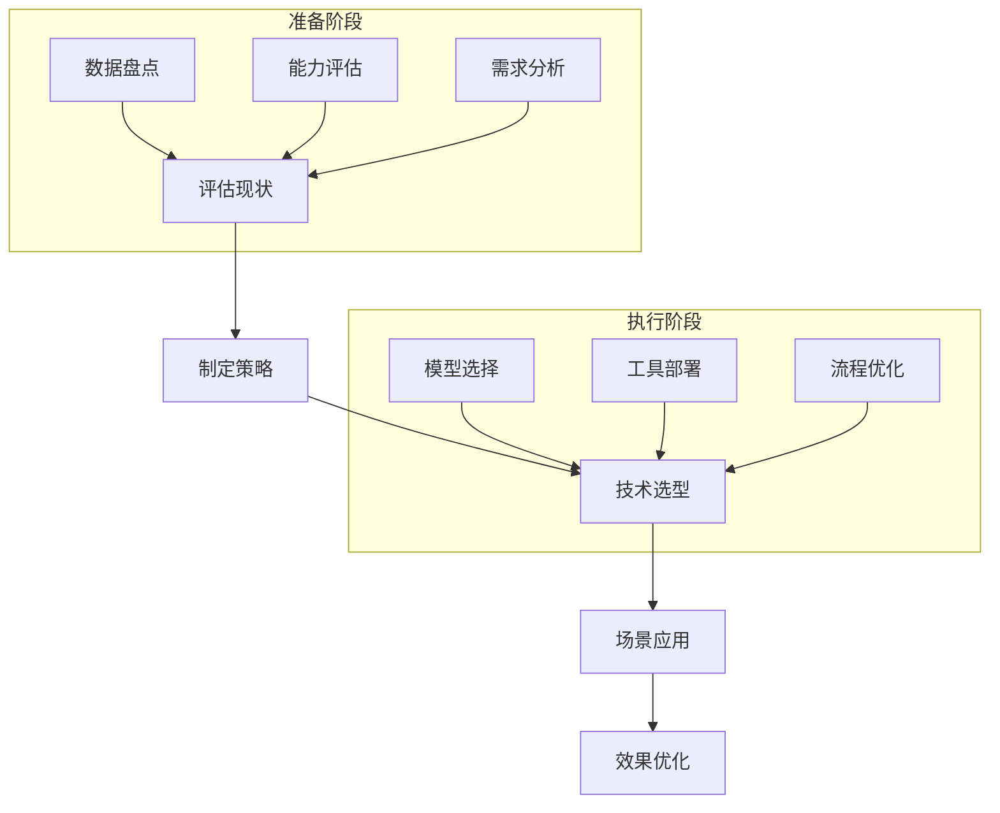
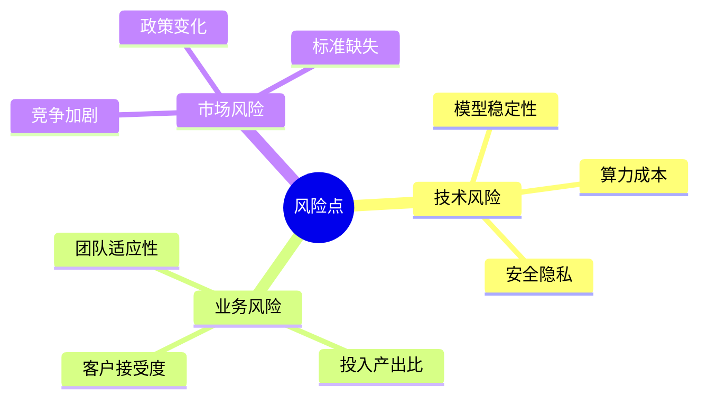
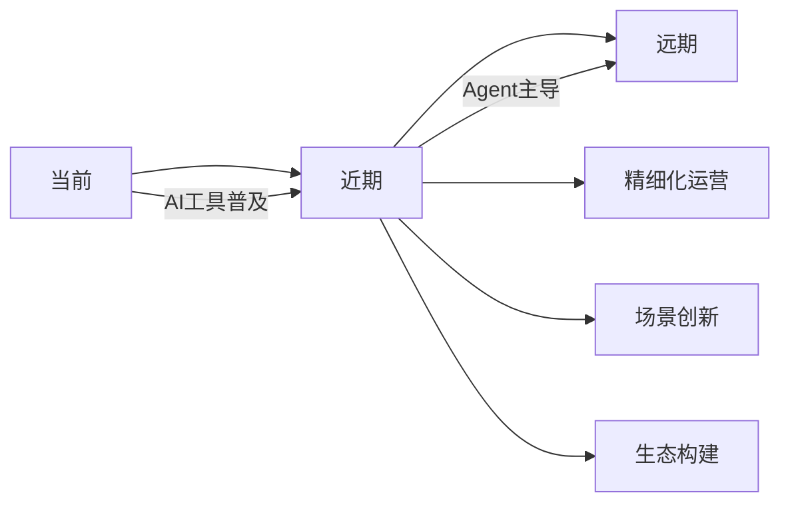

# AI演讲内容深度解析：《AI营销工具全面智能化》

## 1. 原文概要

```text
演讲主题：AI营销工具全面智能化
演讲人：赵旭隆（Marketingforce迈富时创始人、董事长兼CEO）
场合：WIM2024创新者年会
时间：2024年12月18日
地点：北京威斯汀酒店
```

## 2. 核心观点提取（10分钟）



## 3. 深度分析（20分钟）

### 3.1 AI演进路径分析


### 3.2 市场规模预测
1. **2023年基数**
   - 全球市场：38.6亿美元
   - 增长率：45.1% CAGR

2. **2030年预测**
   - 市场规模：503亿美元
   - 增长潜力：13倍扩张

### 3.3 营销场景应用分析


## 4. 关键洞察（15分钟）

### 4.1 技术发展趋势


### 4.2 营销变革分析

1. **传统营销痛点**
   - 人工效率低
   - 成本持续上升
   - 体验不连续
   - 数据难应用

2. **AI解决方案**
   - 自动化流程
   - 智能化决策
   - 个性化服务
   - 数据价值化

3. **未来发展方向**
   - Agent主导
   - 精细化运营
   - 场景创新
   - 生态融合

## 5. 实践建议（10分钟）

### 5.1 企业实施路径


### 5.2 关键成功要素
1. **领导重视**
   - "一把手工程"
   - 战略级别项目
   - 资源优先保障

2. **数据基础**
   - 数据质量
   - 数据量级
   - 数据治理

3. **人才准备**
   - 技术团队
   - 业务专家
   - 运营人员

## 6. 风险提示（5分钟）

### 6.1 潜在风险


### 6.2 应对策略
1. **技术层面**
   - 多模型备份
   - 成本优化
   - 安全加固

2. **业务层面**
   - ROI跟踪
   - 渐进实施
   - 持续培训

3. **市场层面**
   - 竞争监测
   - 政策跟踪
   - 标准参与

## 7. 未来展望（5分钟）

### 7.1 发展趋势


### 7.2 行动建议
1. **企业层面**
   - 提前布局
   - 积累数据
   - 培养人才

2. **行业层面**
   - 标准制定
   - 生态共建
   - 价值共享

3. **社会层面**
   - 伦理规范
   - 安全保障
   - 普惠发展 