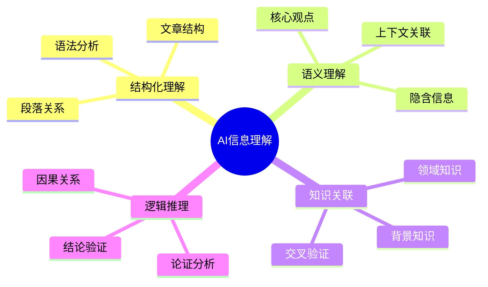
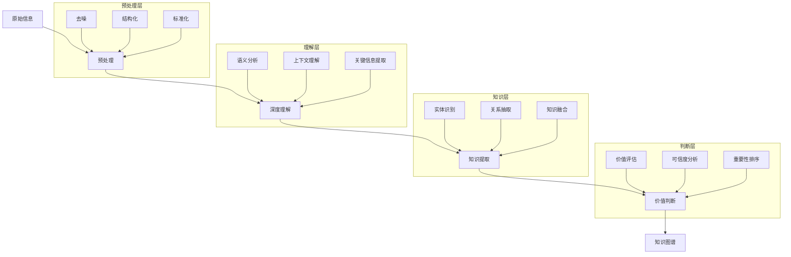
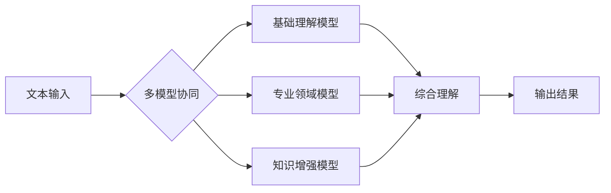
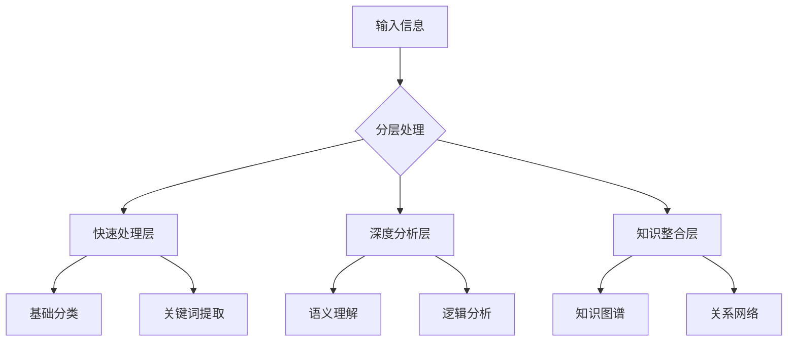

# AI信息处理核心思考

## 1. 信息理解层次

## 2. 信息处理流程

## 3. 核心处理机制

### 3.1 多维度理解

### 3.2 深度分析策略

1. **文本理解策略**
   - 多轮理解：先粗后细
   - 层级分析：从整体到局部
   - 交叉验证：多模型互补

2. **知识提取策略**
   - 显式信息：直接提取关键事实
   - 隐式信息：上下文推理
   - 关联信息：知识库补充

3. **价值判断策略**
   - 重要性评估：基于用户需求
   - 时效性判断：信息新鲜度
   - 可信度分析：源可靠性

## 4. 智能化处理方法

### 4.1 信息分层处理

### 4.2 核心算法策略

1. **注意力机制**
   - 关键信息识别
   - 重点内容定位
   - 上下文关联

2. **知识融合**
   - 多源信息整合
   - 知识库匹配
   - 动态更新

3. **推理能力**
   - 因果推理
   - 逻辑推理
   - 类比推理

## 5. 效果优化

### 5.1 准确性提升

### 5.2 效率优化
- 分级处理机制
- 并行计算策略
- 缓存优化
- 增量更新

## 6. 关键挑战

1. **理解深度**
   - 上下文把握
   - 隐含信息提取
   - 观点准确理解

2. **知识整合**
   - 知识体系构建
   - 信息一致性
   - 知识更新

3. **推理能力**
   - 因果关系分析
   - 逻辑推理准确性
   - 结论可靠性 