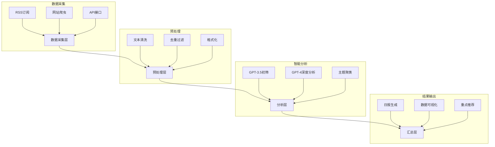
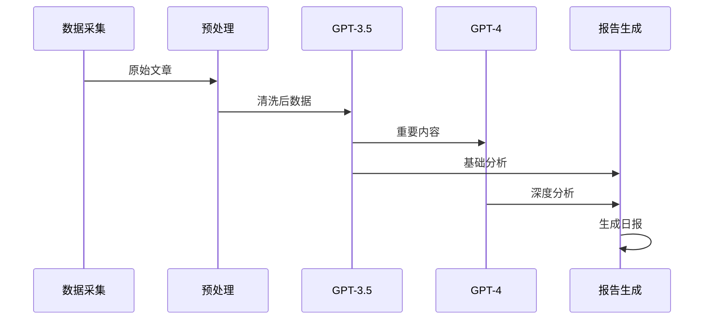
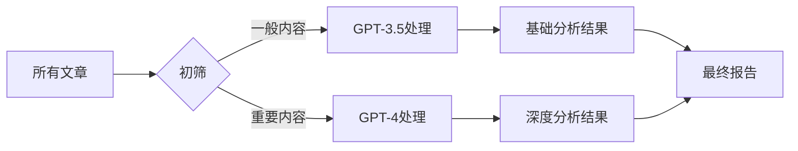

# LLM智能分析系统设计方案

## 1. 系统概述

本文档详细说明了基于LLM的24小时文章监控分析系统的设计方案。该系统旨在自动化文章收集、分析和汇总的过程，提供高质量的每日分析报告。

## 2. 系统架构

## 3. LLM模型选择

### 3.1 主要模型

- **GPT-4**
  - 用途：深度分析、最终汇总
  - 优势：理解能力强、输出质量高
  - 场景：重要文章分析、观点提取、趋势总结

### 3.2 辅助模型

- **GPT-3.5**
  - 用途：初步筛选、基础分析
  - 优势：成本低、速度快
  - 场景：文章分类、关键词提取、基础摘要

## 4. 处理流程

## 5. 系统功能模块

### 5.1 数据采集模块
- RSS订阅源监控
- 网站定时爬虫
- API数据对接
- 邮件订阅转发

### 5.2 预处理模块
- 文本提取清洗
- 重复内容过滤
- 格式标准化
- 优先级分类

### 5.3 分析模块
- 文章分类标注
- 关键信息提取
- 观点分析
- 情感分析
- 价值评估

### 5.4 汇总模块
- 每日报告生成
- 数据可视化
- 重点内容推荐
- 趋势分析

## 6. 成本优化策略

## 7. 监控与优化

### 7.1 系统监控
- API调用统计
- 错误率监控
- 性能指标跟踪
- 成本控制

### 7.2 质量优化
- 分析结果评估
- 模型效果优化
- 用户反馈收集
- 持续改进机制

## 8. 注意事项

### 8.1 系统稳定性
- 异常处理机制
- 备份策略
- 失败重试机制

### 8.2 数据安全
- 数据加密存储
- 访问权限控制
- 敏感信息保护

### 8.3 成本控制
- API使用优化
- 资源调度策略
- 成本预警机制 