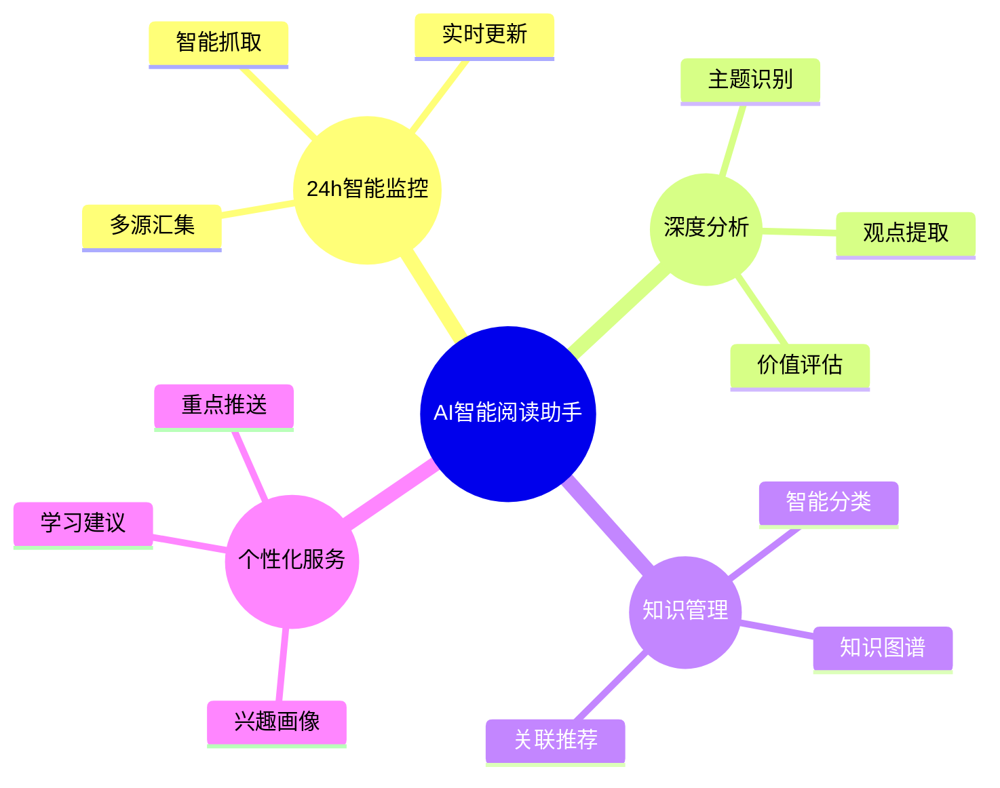
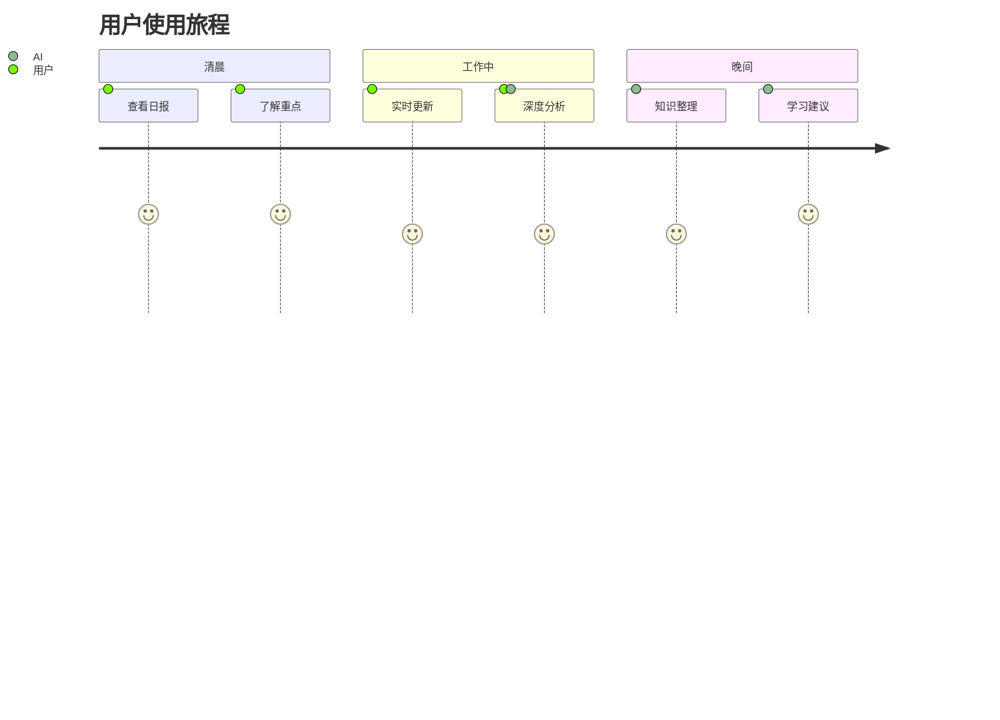
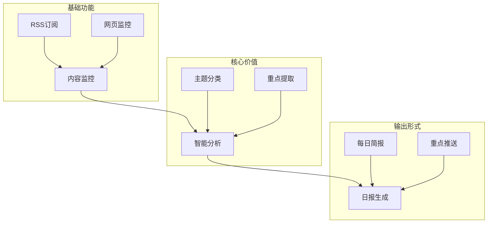
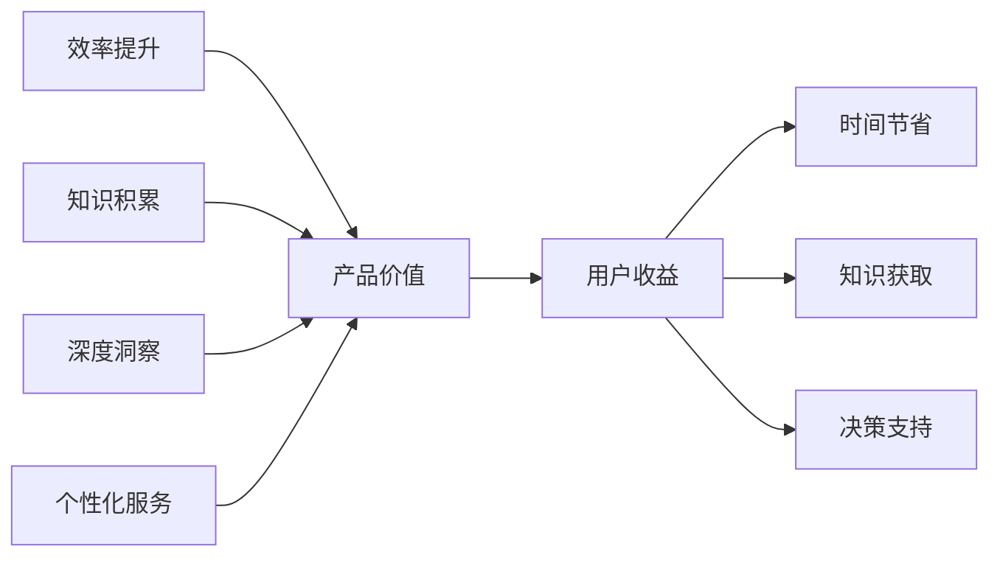
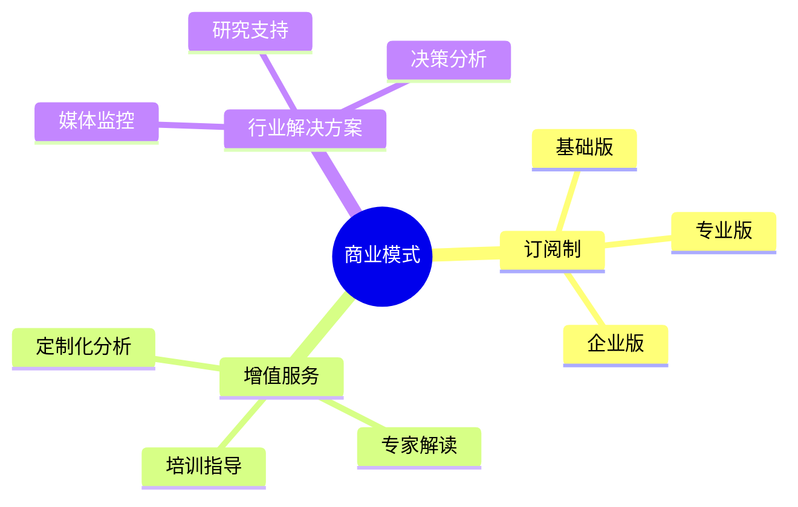

# AI智能阅读助手产品方案

## 1. 用户痛点分析

在信息爆炸的时代，用户面临以下核心痛点：
- 信息量大，难以及时处理
- 重要内容可能错过
- 阅读耗时，效率低下
- 难以建立知识体系

## 2. 产品定位

## 3. 用户场景分析

### 3.1 目标用户画像
- 知识工作者
- 研究人员
- 内容创作者
- 决策管理者

### 3.2 核心场景

## 4. 产品功能规划

### 4.1 MVP(最小可行产品)阶段

### 4.2 迭代规划

1. **第一阶段（1-2个月）**
   - 基础监控功能
   - 简单的分析汇总
   - 日报推送

2. **第二阶段（3-4个月）**
   - 多源数据整合
   - 深度分析能力
   - 个性化定制

3. **第三阶段（5-6个月）**
   - 知识图谱构建
   - 智能推荐
   - 协作分享

## 5. 产品核心价值

## 6. 运营策略

### 6.1 获客策略
- 免费试用期
- 场景化营销
- 口碑传播
- 专业社群

### 6.2 留存策略
- 个性化体验
- 持续优化
- 社区运营
- 专家指导

## 7. 商业模式

## 8. 风险评估

### 8.1 技术风险
- AI模型稳定性
- 内容质量把控
- 系统可靠性

### 8.2 运营风险
- 用户体验
- 内容版权
- 数据安全

### 8.3 市场风险
- 竞品分析
- 市场教育
- 商业模式验证

## 9. 成功指标

### 9.1 核心指标
- DAU/MAU
- 用户留存率
- 付费转化率
- 用户满意度

### 9.2 业务指标
- 内容覆盖率
- 分析准确率
- 响应时间
- 系统稳定性 